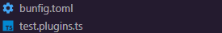

# Bun test ModuleNameMapper

This module performs the same function as "moduleNameMapper" in jest, the only difference is that bunModuleNameMapper is designed to bun

## Configuration

Bun carries out its configuration in a file named [bunfig.toml](https://bun.sh/docs/runtime/bunfig) and loads the plugins in a ts file which we can call `test.plugins.ts`. These files are located in the root of your project. With this in mind, let's look at the configuration.



In your bunfig.toml file, add your test.plugins.ts file as a preload file for the tests.

`test.plugins.ts`

```toml
[test]
preload = ['./test.plugins.ts']
```

Next, in your test.plugins.ts file, run the plugin with your desired configuration. This works as jest’s moduleNameMapper would.

`test.plugins.ts`

```ts
import { plugin } from 'bun'
import nameMapper from 'bun-module-name-mapper'
plugin(
	BunModuelNameMapperPlugin({
		'^@/(.*)$': 'src/$1', // this is an example

		// Here is your configuration as it
		// would be in jest’s moduleNameMapper.
	}),
)
```

## Not supported

{"^src/(.*)$": "```<rootDir>```/src/$1"}

The ```rootDir``` is not supported because bun inherently understands the default aliases. Therefore, there is no need to manipulate your testing module to achieve this. Instead, configure your aliases directly in the tsconfig.json file. This approach promotes a more streamlined and professional workflow.”

> If you think rootDir is still needed, please leave an issuse and I'll consider adding it.# bun-module-name-mapper
